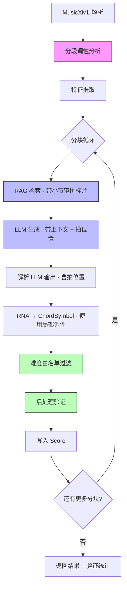

# 设计文档：和声管线改进

## 概述

本设计文档描述对 `HarmonizePipeline` 和弦生成管线的六项改进的技术方案。改进涵盖：分块上下文传递、RAG/LLM 对齐、拍位置智能分配、后处理验证层、分段转调检测、以及难度白名单过滤。

所有改进均在现有架构上增量实施，不改变管线的整体流程（解析 → 调性分析 → 特征提取 → RAG 检索 → LLM 生成 → 写回 Score），而是在各环节内部增强能力。

## 架构

### 改进后的管线流程



### 变更范围

| 文件 | 变更类型 | 涉及需求 |
|------|---------|---------|
| `key-analyzer.ts` | 新增分段分析函数 | 需求 5 |
| `harmonize-pipeline.ts` | 修改主循环，集成所有改进 | 需求 1-6 |
| `llm-harmonizer.ts` | 修改 prompt 构建和输出解析 | 需求 1, 2, 3 |
| `melody-features.ts` | 修改 prompt 描述函数 | 需求 2 |
| 新增 `chord-validator.ts` | 新文件：后处理验证 | 需求 4 |
| 新增 `difficulty-filter.ts` | 新文件：难度白名单过滤 | 需求 6 |
| `types.ts` | 扩展 PipelineResult 类型 | 需求 4, 5 |

## 组件与接口

### 1. 分块上下文传递（需求 1）

修改 `LLMHarmonizer.harmonize()` 方法签名，增加可选的 `previousChords` 参数：

```typescript
// llm-harmonizer.ts
async harmonize(
  features: MelodyFeatures,
  measureStart: number,
  measureEnd: number,
  ragResults: RetrievalResult[],
  previousChords?: string[]  // 新增：前一分块最后 1-2 个和弦（RNA 格式）
): Promise<MeasureChords[]>
```

修改 `buildUserPrompt` 在 prompt 开头插入上下文：

```typescript
function buildUserPrompt(
  features: MelodyFeatures,
  measureStart: number,
  measureEnd: number,
  ragResults: AnnotatedRAGResult[],  // 改为带标注的结果
  previousChords?: string[]
): string {
  const parts: string[] = [];
  
  // 上下文信息
  if (previousChords && previousChords.length > 0) {
    parts.push(`=== 前一段结尾和弦 ===`);
    parts.push(`${previousChords.join(' → ')}`);
    parts.push('请确保和弦进行与上述结尾和弦自然衔接。\n');
  }
  // ... 其余不变
}
```

在 `HarmonizePipeline` 的分块循环中，追踪上一分块的最后和弦：

```typescript
let previousChords: string[] = [];

for (let i = 0; i < score.measures.length; i += chunkSize) {
  // ... RAG 检索 ...
  
  const measureChords = await this.harmonizer.harmonize(
    features, i, end, ragResults, previousChords
  );
  
  // 记录本分块最后 1-2 个和弦供下一分块使用
  if (measureChords.length > 0) {
    const lastMeasure = measureChords[measureChords.length - 1];
    previousChords = lastMeasure.chords.slice(-2);
  }
}
```

### 2. RAG 查询与 LLM 分块对齐（需求 2）

引入带标注的 RAG 结果类型：

```typescript
// llm-harmonizer.ts
interface AnnotatedRAGResult {
  result: RetrievalResult;
  measureRange: { start: number; end: number };  // 对应的小节范围
}
```

修改管线中的 RAG 结果收集，保留小节范围信息：

```typescript
// harmonize-pipeline.ts - 分块循环内
const annotatedResults: AnnotatedRAGResult[] = [];
const queryStart = Math.floor(i / 2);
const queryEnd = Math.min(Math.ceil(end / 2), queries.length);

for (let qi = queryStart; qi < queryEnd; qi++) {
  const results = await this.retriever.retrieve(queries[qi], features.mode);
  const measureRangeStart = qi * 2;
  const measureRangeEnd = Math.min(measureRangeStart + 2, score.measures.length);
  for (const r of results) {
    annotatedResults.push({
      result: r,
      measureRange: { start: measureRangeStart + 1, end: measureRangeEnd },
    });
  }
}
```

修改 `buildUserPrompt` 按小节范围分组展示参考：

```typescript
// prompt 中的展示格式
// === 参考和弦进行（来自相似旋律） ===
// 小节 1-2 的参考:
//   参考1 (Artist/Song, 相似度85%): I → IV → V → I
// 小节 3-4 的参考:
//   参考1 (Artist/Song, 相似度78%): vi → IV → I → V
```

### 3. 基于旋律节奏的拍位置分配（需求 3）

修改系统 prompt，要求 LLM 输出拍位置：

```typescript
// buildSystemPrompt 中新增规则
// 输出格式：每个小节一行，格式为 "小节号: 和弦1(拍位置) [和弦2(拍位置)]"
// 拍位置从 1 开始，可以是小数（如 3.5 表示第三拍后半拍）
// 示例：
// 1: I(1)
// 2: IV(1) V(3)
// 3: vi(1) IV(2.5)
// 4: V(1) I(3)
```

扩展 `parseLLMOutput` 以解析拍位置：

```typescript
interface MeasureChords {
  measureNumber: number;
  chords: string[];
  beats?: number[];  // 新增：每个和弦的拍位置（可选，向后兼容）
}

function parseLLMOutput(output: string): MeasureChords[] {
  // 新增正则：匹配 "I(1)" 或 "V7(3.5)" 格式
  // 如果没有括号，beats 为 undefined，触发回退逻辑
  const chordWithBeatRegex = /([#b]?[IiVv][IiVv]*[^(\s]*)\((\d+(?:\.\d+)?)\)/g;
  // ...
}
```

修改 `applyToScore`：优先使用 LLM 指定的拍位置，否则回退到均匀分配：

```typescript
applyToScore(score: Score, measureChords: MeasureChords[]): void {
  for (const mc of measureChords) {
    const measure = score.measures.find(m => m.number === mc.measureNumber);
    if (!measure) continue;

    measure.chords = [];
    for (let i = 0; i < mc.chords.length; i++) {
      // 优先使用 LLM 指定的拍位置
      let beat: number;
      if (mc.beats && mc.beats[i] !== undefined) {
        beat = mc.beats[i] - 1;  // LLM 输出从 1 开始，内部从 0 开始
      } else {
        // 回退：均匀分配
        const beatsPerMeasure = (measure.timeChange ?? score.time).beats;
        beat = i * (beatsPerMeasure / mc.chords.length);
      }
      
      const chord = rnaToChordSymbol(mc.chords[i], tonicSemitone, mode, beat);
      if (chord) measure.chords.push(chord);
    }
  }
}
```

### 4. 后处理验证层（需求 4）

新建 `harmony-engine/src/harmonizer/chord-validator.ts`：

```typescript
import type { Score, Measure, ChordSymbol } from '../core/types.js';

/** 验证结果 */
export interface ValidationResult {
  /** 和弦音覆盖检查通过率 */
  coveragePassRate: number;
  /** 转换概率检查通过率 */
  transitionPassRate: number;
  /** 异常详情 */
  anomalies: ValidationAnomaly[];
}

export interface ValidationAnomaly {
  type: 'coverage' | 'transition';
  measureNumber: number;
  beat: number;
  detail: string;
}

/** 加载转移概率矩阵 */
export function loadTransitionMatrix(
  path: string
): Record<string, Record<string, number>>;

/** 检查和弦音是否覆盖强拍旋律音 */
export function checkChordCoverage(
  measure: Measure,
  chord: ChordSymbol,
  beat: number
): boolean;

/** 检查相邻和弦转换概率 */
export function checkTransitionProbability(
  fromChord: string,
  toChord: string,
  transitionMatrix: Record<string, Record<string, number>>,
  threshold: number
): { pass: boolean; probability: number };

/** 对整个 Score 执行验证 */
export function validateHarmonization(
  score: Score,
  transitionMatrix: Record<string, Record<string, number>>,
  transitionThreshold?: number  // 默认 0.005
): ValidationResult;
```

验证逻辑：
- **和弦音覆盖检查**：对每个强拍（beat 0 和 beat 2 在 4/4 拍中），获取该拍上的旋律音，检查是否为当前和弦的和弦音（根音、三音、五音、七音）。使用 `CHORD_TEMPLATES` 常量计算和弦音集合。
- **转换概率检查**：将相邻和弦转为 RNA 格式，在 `chord_transitions.json` 中查找转换概率。低于阈值（默认 0.005）的标记为异常。
- 验证结果仅记录警告，不修改和弦。

### 5. 分段调性分析与转调检测（需求 5）

扩展 `key-analyzer.ts`，新增分段分析函数：

```typescript
/** 转调信息 */
export interface ModulationPoint {
  /** 转调发生的小节号 */
  measureNumber: number;
  /** 新调性 */
  newKey: KeySignature;
  /** 置信度 */
  confidence: number;
}

/** 分段调性分析结果 */
export interface SegmentedKeyResult {
  /** 初始调性 */
  initialKey: KeyAnalysisResult;
  /** 转调点列表 */
  modulations: ModulationPoint[];
}

/**
 * 分段调性分析
 * 
 * 算法：
 * 1. 滑动窗口（8 小节窗口，2 小节步长）计算每个窗口的 KS 最佳调性
 * 2. 检测相邻窗口调性变化的区域
 * 3. 在变化区域内逐小节计算累积 KS 相关系数，定位跳变点
 * 4. 验证转调前后各 4 小节的置信度 > 阈值
 */
export function analyzeKeySegmented(
  score: Score,
  options?: {
    windowSize?: number;      // 默认 8
    stepSize?: number;        // 默认 2
    confidenceThreshold?: number;  // 默认 0.65
  }
): SegmentedKeyResult;

/**
 * 获取指定小节的有效调性
 * 从 Score 的初始调性开始，查找最近的 keyChange
 */
export function getEffectiveKey(
  score: Score,
  measureNumber: number
): KeySignature;
```

算法细节：
1. 对每个滑动窗口位置，提取该窗口内小节的音高分布，运行 KS 算法得到最佳调性
2. 遍历窗口序列，找到调性发生变化的相邻窗口对
3. 在变化区域（两个窗口的重叠范围）内，逐小节从左向右累积音高分布，计算 KS 相关系数，找到相关系数发生最大跳变的小节
4. 对候选转调点，分别对前 4 小节和后 4 小节独立运行 KS，验证两侧置信度均 > 阈值
5. 短曲（< 12 小节）跳过分段分析

### 6. 难度级别和弦白名单过滤（需求 6）

新建 `harmony-engine/src/harmonizer/difficulty-filter.ts`：

```typescript
/** 各难度级别的 RNA 白名单 */
export const DIFFICULTY_WHITELISTS: Record<string, string[]> = {
  basic: ['I', 'IV', 'V', 'vi'],
  intermediate: ['I', 'ii', 'iii', 'IV', 'V', 'vi', 'vii°',
                  'I7', 'ii7', 'IV7', 'V7', 'vi7', 'IVmaj7', 'Imaj7'],
  advanced: [],  // 空数组表示不限制
};

/** 功能替换映射（不在白名单中的和弦 → 最接近的允许和弦） */
export const FUNCTIONAL_SUBSTITUTIONS: Record<string, Record<string, string>> = {
  basic: {
    'ii': 'IV',    // 下属功能
    'iii': 'I',    // 主功能
    'vii°': 'V',   // 属功能
    'II': 'V',     // 属功能
    'III': 'I',    // 主功能
    'VII': 'V',    // 属功能
    // 七和弦降级
    'V7': 'V',
    'ii7': 'IV',
    'vi7': 'vi',
    'IVmaj7': 'IV',
    'Imaj7': 'I',
  },
  intermediate: {
    // intermediate 允许大部分顺阶和弦，只需处理离调和弦
    'bVII': 'V',
    'bIII': 'iii',
    'bVI': 'vi',
    '#IV': 'IV',
  },
};

export interface FilterResult {
  /** 过滤后的和弦（RNA 格式） */
  filtered: string;
  /** 是否被替换 */
  wasReplaced: boolean;
  /** 原始和弦（如果被替换） */
  original?: string;
}

/** 对单个和弦执行白名单过滤 */
export function filterChord(
  chord: string,
  difficulty: string
): FilterResult;

/** 对一组 MeasureChords 执行批量过滤 */
export function filterMeasureChords(
  measureChords: MeasureChords[],
  difficulty: string
): { filtered: MeasureChords[]; replacements: FilterResult[] };
```

过滤逻辑：
1. `advanced` 级别直接跳过
2. 将输入和弦标准化（去掉转位标记等），与白名单比对
3. 不在白名单中的和弦，查找 `FUNCTIONAL_SUBSTITUTIONS` 映射
4. 如果映射中也没有，回退到功能分析：根据和弦级数判断其功能（主、下属、属），替换为该功能组中白名单内的默认和弦

### 管线集成

修改 `HarmonizePipeline` 构造函数和主循环：

```typescript
export class HarmonizePipeline {
  private transitionMatrix?: Record<string, Record<string, number>>;
  
  constructor(config: PipelineConfig) {
    // ... 现有初始化 ...
    
    // 加载转移概率矩阵（用于验证）
    if (config.transitionMatrixPath) {
      this.transitionMatrix = loadTransitionMatrix(config.transitionMatrixPath);
    }
  }
  
  async harmonizeFromXML(xml: string): Promise<PipelineResult> {
    // 1. 解析
    // 2. 分段调性分析（替代原来的单次分析）
    const segmentedKey = analyzeKeySegmented(score);
    // 将转调信息写入 Score
    for (const mod of segmentedKey.modulations) {
      const measure = score.measures.find(m => m.number === mod.measureNumber);
      if (measure) measure.keyChange = mod.newKey;
    }
    
    // 3. 特征提取
    // 4. 分块循环
    let previousChords: string[] = [];
    let allAnomalies: ValidationAnomaly[] = [];
    
    for (let i = 0; i < score.measures.length; i += chunkSize) {
      // RAG 检索（带标注）
      // LLM 生成（带上下文 + 局部调性）
      // 难度白名单过滤
      // 后处理验证
      // 写入 Score
      // 更新 previousChords
    }
    
    // 5. 返回结果（含验证统计和转调信息）
  }
}
```

## 数据模型

### 扩展 PipelineResult

```typescript
export interface PipelineResult {
  score: Score;
  keyAnalysis: {
    key: string;
    confidence: number;
    source: string;
    /** 新增：转调信息 */
    modulations?: Array<{
      measureNumber: number;
      newKey: string;
      confidence: number;
    }>;
  };
  stats: {
    totalMeasures: number;
    apiCalls: number;
    durationMs: number;
  };
  /** 新增：验证统计 */
  validation?: {
    coveragePassRate: number;
    transitionPassRate: number;
    anomalyCount: number;
    anomalies: ValidationAnomaly[];
  };
  /** 新增：难度过滤统计 */
  difficultyFilter?: {
    totalChords: number;
    replacedCount: number;
    replacements: Array<{ measure: number; original: string; replacement: string }>;
  };
}
```

### 扩展 PipelineConfig

```typescript
export interface PipelineConfig {
  apiKey: string;
  phrasesPath: string;
  model?: string;
  difficulty?: 'basic' | 'intermediate' | 'advanced';
  topK?: number;
  enableRAG?: boolean;
  /** 新增：转移概率矩阵路径 */
  transitionMatrixPath?: string;
  /** 新增：转换概率异常阈值 */
  transitionThreshold?: number;
  /** 新增：是否启用后处理验证 */
  enableValidation?: boolean;
}
```

### MeasureChords 扩展

```typescript
interface MeasureChords {
  measureNumber: number;
  chords: string[];
  /** 新增：每个和弦的拍位置（LLM 输出，1-based） */
  beats?: number[];
}
```

### AnnotatedRAGResult

```typescript
interface AnnotatedRAGResult {
  result: RetrievalResult;
  measureRange: { start: number; end: number };
}
```


## 正确性属性

*正确性属性是一种在系统所有有效执行中都应成立的特征或行为——本质上是关于系统应该做什么的形式化陈述。属性是人类可读规范与机器可验证正确性保证之间的桥梁。*

以下属性基于需求文档中的验收标准推导而来，经过冗余合并后保留了具有独立验证价值的属性。

### Property 1: 前置和弦上下文包含在 prompt 中

*For any* 非空的前置和弦列表 `previousChords`，调用 `buildUserPrompt` 生成的 prompt 字符串应包含 `previousChords` 中的每个和弦符号。当 `previousChords` 为空或 undefined 时，prompt 中不应包含"前一段结尾和弦"相关内容。

**Validates: Requirements 1.1, 1.3**

### Property 2: RAG 结果按小节范围分组标注

*For any* 带标注的 RAG 结果列表 `AnnotatedRAGResult[]`，调用 `buildUserPrompt` 生成的 prompt 字符串应为每条结果包含其 `measureRange` 的起止小节号，且相同 `measureRange` 的结果应被分组在一起展示。

**Validates: Requirements 2.1, 2.2, 2.3**

### Property 3: 拍位置解析正确性

*For any* 符合格式 `"小节号: 和弦(拍位置) [和弦(拍位置)]"` 的 LLM 输出字符串，`parseLLMOutput` 应正确提取每个和弦的 RNA 符号和对应的拍位置数值。解析出的 `beats` 数组长度应等于 `chords` 数组长度。

**Validates: Requirements 3.1**

### Property 4: 拍位置应用优先级

*For any* `MeasureChords` 对象，当 `beats` 字段存在时，`applyToScore` 应将和弦的 `beat` 设置为 `beats[i] - 1`（从 1-based 转为 0-based）；当 `beats` 字段不存在时，应回退到均匀分配。

**Validates: Requirements 3.2, 3.3**

### Property 5: 和弦音覆盖检查正确性

*For any* 和弦 `ChordSymbol` 和强拍上的旋律音 `Note`，`checkChordCoverage` 返回 `true` 当且仅当该旋律音的音高（mod 12）属于该和弦根据 `CHORD_TEMPLATES` 计算出的和弦音集合。

**Validates: Requirements 4.1**

### Property 6: 转换概率查询正确性

*For any* 两个 RNA 和弦字符串 `from` 和 `to`，`checkTransitionProbability` 返回的概率值应等于 `transitionMatrix[from][to]`（如果存在），否则为 0。`pass` 字段应等于 `probability >= threshold`。

**Validates: Requirements 4.2**

### Property 7: 验证不修改和弦数据

*For any* Score 对象，执行 `validateHarmonization` 后，Score 中每个 Measure 的 `chords` 数组应与验证前完全相同（深度相等）。

**Validates: Requirements 4.3**

### Property 8: getEffectiveKey 返回正确调性

*For any* Score 对象（其中某些 Measure 设置了 `keyChange`），对于任意小节号 `n`，`getEffectiveKey(score, n)` 应返回小节 `n` 或之前最近一个设置了 `keyChange` 的小节的调性；如果之前没有 `keyChange`，应返回 `score.key`。

**Validates: Requirements 5.5, 5.6**

### Property 9: 短曲跳过分段分析

*For any* 总小节数不足 12 的 Score 对象，`analyzeKeySegmented` 返回的 `modulations` 数组应为空。

**Validates: Requirements 5.8**

### Property 10: 难度过滤输出始终合规

*For any* RNA 和弦字符串和难度级别，`filterChord` 的输出应满足：(a) 当难度为 `advanced` 时，输出等于输入（不做任何替换）；(b) 当难度为 `basic` 或 `intermediate` 时，输出的和弦（去掉修饰后的基础级数）必须在对应难度的白名单中。

**Validates: Requirements 6.2, 6.3, 6.5**

## 错误处理

### LLM 输出解析容错

- `parseLLMOutput` 在解析拍位置时，如果格式不符合 `和弦(拍位置)` 模式，应回退到无拍位置模式（`beats` 为 `undefined`），不抛出异常
- 拍位置值超出小节范围（如 4/4 拍中出现 beat > 4）时，应 clamp 到有效范围

### 转移矩阵缺失处理

- 如果 `chord_transitions.json` 加载失败或路径未配置，验证层应跳过转换概率检查，仅执行和弦音覆盖检查
- 转移矩阵中不存在的和弦对，转换概率视为 0，但不标记为异常（因为矩阵可能不完整）

### 转调检测边界情况

- 乐曲首尾各 4 小节不作为转调点候选（窗口不完整）
- 连续多次转调（如 A → B → C）应逐一检测，每个转调点独立验证
- 如果整首曲子的 KS 置信度都很低（< 0.5），跳过分段分析，信任 MusicXML 调号

### 难度过滤回退

- 如果和弦在 `FUNCTIONAL_SUBSTITUTIONS` 映射中找不到对应替换，回退到该和弦功能组的默认和弦（主功能 → I，下属功能 → IV，属功能 → V）
- 无法识别的和弦格式（如 RNA 解析失败）保留原样，记录警告

## 测试策略

### 测试框架

- 单元测试和属性测试均使用 **Vitest** + **fast-check**
- 属性测试每个 property 至少运行 100 次迭代

### 属性测试（Property-Based Testing）

每个正确性属性对应一个独立的属性测试，使用 fast-check 生成随机输入：

| Property | 测试文件 | 生成器 |
|----------|---------|--------|
| P1: 前置和弦上下文 | `llm-harmonizer.test.ts` | 随机 RNA 和弦字符串数组 |
| P2: RAG 结果标注 | `llm-harmonizer.test.ts` | 随机 AnnotatedRAGResult 列表 |
| P3: 拍位置解析 | `llm-harmonizer.test.ts` | 随机生成符合格式的 LLM 输出字符串 |
| P4: 拍位置应用 | `llm-harmonizer.test.ts` | 随机 MeasureChords（有/无 beats） |
| P5: 和弦音覆盖 | `chord-validator.test.ts` | 随机 ChordSymbol + 随机 Note |
| P6: 转换概率查询 | `chord-validator.test.ts` | 随机和弦对 + 随机阈值 |
| P7: 验证非破坏性 | `chord-validator.test.ts` | 随机 Score |
| P8: 有效调性查询 | `key-analyzer.test.ts` | 随机 Score（含 keyChange） |
| P9: 短曲跳过分段 | `key-analyzer.test.ts` | 随机短 Score（< 12 小节） |
| P10: 难度过滤合规 | `difficulty-filter.test.ts` | 随机 RNA 和弦 + 随机难度级别 |

### 单元测试

单元测试覆盖具体示例和边界情况：

- **转调检测**：构造明确转调的 Score（如前半 C 大调、后半 G 大调），验证检测到正确的转调点（需求 5.2）
- **转调误报过滤**：构造含色彩音但不转调的 Score，验证不报告转调（需求 5.3）
- **白名单定义**：验证 basic 白名单为 `[I, IV, V, vi]`（需求 6.1）
- **系统 prompt 格式**：验证 buildSystemPrompt 包含拍位置格式说明（需求 3.4）
- **PipelineResult 结构**：验证结果包含 validation 和 modulations 字段（需求 4.4, 5.7）

### 测试标注格式

每个属性测试必须包含注释标注：

```typescript
// Feature: harmonize-pipeline-improvements, Property 1: 前置和弦上下文包含在 prompt 中
it.prop('前置和弦上下文应出现在 prompt 中', [fc.array(fc.string())], (previousChords) => {
  // ...
});
```
