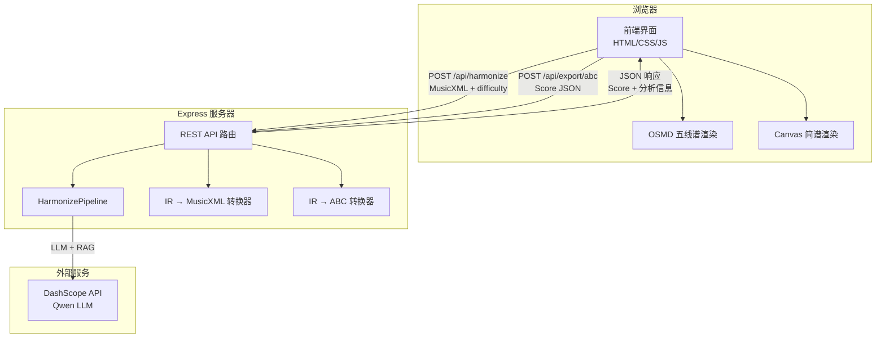
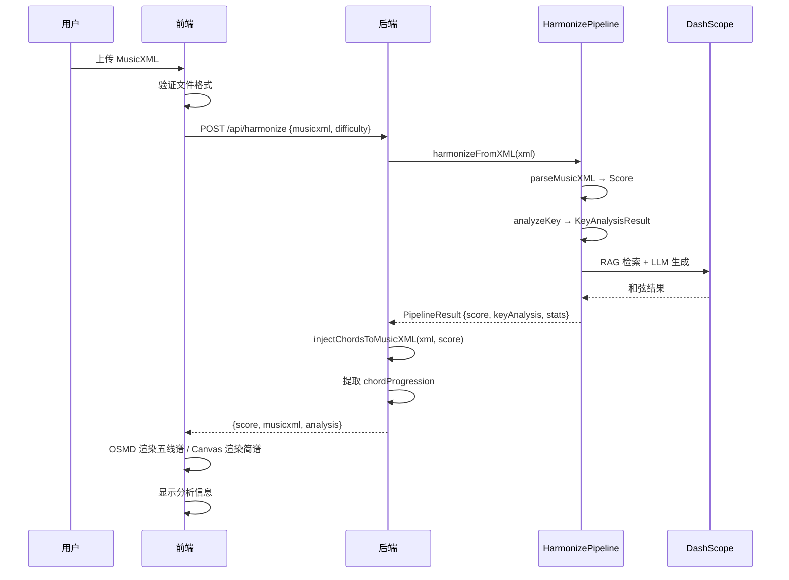

# 设计文档：Harmony Engine Web 前端

## 概述

本设计为 Harmony Engine 构建一个完整的 Web 前端应用，包含一个 Express 后端服务器和一个复古典雅风格的浏览器端界面。后端负责代理 DashScope API 调用、执行和声分析管线、以及 IR 格式转换；前端负责文件上传、乐谱渲染（五线谱/简谱双视图）、分析信息展示和用户交互。

技术栈选择：
- 后端：Express.js（轻量、生态成熟），复用已有的 harmony-engine TypeScript 模块
- 前端：原生 HTML/CSS/JS（无框架依赖，保持轻量），OSMD 用于五线谱渲染，Canvas 用于简谱渲染
- 构建：无需前端构建工具，后端使用 tsx 直接运行 TypeScript

## 架构



### 请求流程

1. 用户上传 MusicXML 文件或加载示例
2. 前端将 MusicXML 文本 + 难度级别 POST 到 `/api/harmonize`
3. 后端调用 `HarmonizePipeline.harmonizeFromXML()`，获得带和弦的 Score + 分析信息
4. 后端调用 IR→MusicXML 转换器，将 Score 转为带 `<harmony>` 元素的 MusicXML
5. 后端返回 `{ score, musicxml, analysis }` JSON 响应
6. 前端用返回的 MusicXML 驱动 OSMD 渲染五线谱，用 Score 数据驱动 Canvas 渲染简谱
7. 前端在分析信息面板展示调性、和弦进行、统计数据

## 组件与接口

### 后端组件

#### 1. Express 服务器入口 (`server/index.ts`)

```typescript
// 服务器配置
interface ServerConfig {
  port: number;           // 默认 4000
  staticDir: string;      // 前端静态文件目录
  phrasesPath: string;    // Hooktheory 数据路径
}
```

#### 2. 和声分析路由 (`server/routes/harmonize.ts`)

```typescript
// POST /api/harmonize
interface HarmonizeRequest {
  musicxml: string;                              // MusicXML 文本内容
  difficulty: 'basic' | 'intermediate' | 'advanced';  // 难度级别
}

interface HarmonizeResponse {
  score: Score;                    // 带和弦标注的 IR
  musicxml: string;                // 带 <harmony> 的 MusicXML 文本
  analysis: {
    key: string;                   // 如 "C major"
    confidence: number;            // 0-1
    source: string;                // 分析来源
    chordProgression: string[];    // 和弦进行序列，如 ["C", "Am", "F", "G7"]
    stats: {
      totalMeasures: number;
      apiCalls: number;
      durationMs: number;
    };
  };
}
```

#### 3. ABC 导出路由 (`server/routes/export.ts`)

```typescript
// POST /api/export/abc
interface ABCExportRequest {
  score: Score;    // 前端传回的 Score 对象
}

interface ABCExportResponse {
  abc: string;     // ABC Notation 文本
}
```

#### 4. IR → MusicXML 转换器 (`src/converter/ir-to-musicxml.ts`)

```typescript
/**
 * 将 Score 中的和弦标注注入到原始 MusicXML 中
 * @param originalXml - 原始 MusicXML 文本（无和弦）
 * @param score - 带和弦标注的 Score 对象
 * @returns 带 <harmony> 元素的 MusicXML 文本
 */
function injectChordsToMusicXML(originalXml: string, score: Score): string;

/**
 * ChordQuality → MusicXML kind 字符串映射
 */
const QUALITY_TO_KIND: Record<ChordQuality, string>;

/**
 * Accidental → MusicXML alter 数值映射
 */
function accidentalToAlter(acc: Accidental): number;
```

#### 5. IR → ABC Notation 转换器 (`src/converter/ir-to-abc.ts`)

```typescript
/**
 * 将 Score 转换为 ABC Notation 文本
 * @param score - 带和弦标注的 Score 对象
 * @returns ABC Notation 格式文本
 */
function scoreToABC(score: Score): string;

/**
 * 将 KeySignature 转为 ABC 调号字段值
 * 如 KeySignature{C, none, major} → "C"
 */
function keyToABCField(key: KeySignature): string;

/**
 * 将单个音符转为 ABC 音符字符串
 * 如 Note{C, none, 4, quarter} → "C"
 * 如 Note{C, sharp, 5, eighth} → "^c/2"
 */
function noteToABC(note: Note): string;

/**
 * 将 ChordSymbol 转为 ABC 和弦标注
 * 如 ChordSymbol{A, none, minor} → '"Am"'
 */
function chordToABC(chord: ChordSymbol): string;
```

### 前端组件

#### 6. 主页面 (`web/index.html`)

页面结构：
- 顶部标题区：应用名称 + 装饰性音乐符号
- 控制栏：文件上传、加载示例、难度选择、视图切换、导出 ABC
- 乐谱区域：五线谱/简谱渲染容器
- 分析信息面板：调性、和弦进行、统计数据
- 加载状态遮罩层

#### 7. 前端 JavaScript 模块 (`web/app.js`)

```typescript
// 应用状态
interface AppState {
  currentXML: string | null;       // 当前 MusicXML 文本
  currentScore: Score | null;      // 当前 Score 数据
  currentView: 'staff' | 'jianpu'; // 当前视图
  difficulty: 'basic' | 'intermediate' | 'advanced';  // 难度级别
  isLoading: boolean;              // 是否正在加载
}

// 核心函数
async function handleFileUpload(file: File): Promise<void>;
async function loadDemo(): Promise<void>;
async function requestHarmonize(xml: string, difficulty: string): Promise<HarmonizeResponse>;
function renderStaffView(musicxml: string): void;
function renderJianpuView(score: Score): void;
function renderAnalysisPanel(analysis: HarmonizeResponse['analysis']): void;
function switchView(view: 'staff' | 'jianpu'): void;
function setLoading(loading: boolean): void;
async function exportABC(): Promise<void>;
```

## 数据模型

### 核心数据流



### 已有数据类型（复用）

系统复用 `harmony-engine/src/core/types.ts` 中定义的所有类型：
- `Score`：完整乐谱 IR，包含 `measures[]`、`key`、`time`、`tempo`
- `Measure`：小节，包含 `events[]`（音符/休止符）和 `chords[]`（和弦标注）
- `ChordSymbol`：和弦符号，包含 `root`、`rootAccidental`、`quality`、`beat`
- `KeySignature`：调性信息，包含 `tonic`、`mode`、`fifths`

### 新增数据类型

#### MusicXML 和弦映射表

```typescript
// ChordQuality → MusicXML <kind> 映射
const QUALITY_TO_KIND: Record<ChordQuality, string> = {
  major: 'major',
  minor: 'minor',
  diminished: 'diminished',
  augmented: 'augmented',
  dominant7: 'dominant',
  major7: 'major-seventh',
  minor7: 'minor-seventh',
  diminished7: 'diminished-seventh',
  'half-dim7': 'half-diminished',
  sus2: 'suspended-second',
  sus4: 'suspended-fourth',
};
```

#### ABC Notation 映射

```typescript
// 八度映射：IR octave → ABC 表示
// octave 5+ → 小写字母 + 逗号
// octave 4  → 大写字母
// octave 3- → 大写字母 + 逗号

// 时值映射：DurationType → ABC 时值后缀
// whole → "4", half → "2", quarter → "", eighth → "/2", 16th → "/4"
const DURATION_TO_ABC_SUFFIX: Record<DurationType, string> = {
  whole: '4',
  half: '2',
  quarter: '',
  eighth: '/2',
  '16th': '/4',
  '32nd': '/8',
};
```


## 正确性属性

*正确性属性是一种在系统所有有效执行中都应成立的特征或行为——本质上是关于系统应该做什么的形式化陈述。属性是人类可读规范与机器可验证正确性保证之间的桥梁。*

以下属性基于需求文档中的验收标准推导而来，每个属性都包含明确的"对于所有"全称量化语句。

### Property 1: MusicXML 和弦注入往返一致性

*For any* 有效的 Score 对象（包含任意数量的小节和和弦标注），将 Score 中的和弦通过 `injectChordsToMusicXML` 注入到 MusicXML 中，再通过 `parseMusicXML` 解析回 Score，所得到的和弦标注数据（每个小节的 ChordSymbol 列表，包括 root、rootAccidental、quality、beat）应与原始 Score 中的和弦标注等价。

**Validates: Requirements 9.1, 9.2, 9.3**

### Property 2: ABC Notation 转换完整性

*For any* 有效的 Score 对象，`scoreToABC` 生成的 ABC 文本应满足：(a) 包含正确的 `T:` 字段（与 Score.title 一致）、`M:` 字段（与 Score.time 一致）、`K:` 字段（与 Score.key 一致）；(b) 对于 Score 中每个小节的每个和弦标注，ABC 文本中应包含对应的双引号括起的和弦名称；(c) 对于 Score 中每个音符事件，ABC 文本中应包含对应的音符表示。

**Validates: Requirements 10.2, 10.4**

### Property 3: 无效 MusicXML 输入拒绝

*For any* 非 MusicXML 格式的字符串输入（随机文本、HTML、JSON 等），前端的 MusicXML 验证函数应返回验证失败结果，且不应触发后端分析请求。

**Validates: Requirements 1.3**

### Property 4: API 响应结构完整性

*For any* 包含有效 MusicXML 和合法难度级别的分析请求，后端 `/api/harmonize` 接口返回的 JSON 响应应包含 `score`（含 measures 数组）、`musicxml`（非空字符串）和 `analysis`（含 key、confidence、chordProgression、stats 字段）三个顶层字段。

**Validates: Requirements 2.1**

### Property 5: 视图切换数据保持

*For any* 已加载乐谱数据的应用状态，在五线谱和简谱视图之间切换任意次数后，应用状态中的 `currentScore` 和 `currentXML` 数据应保持不变。

**Validates: Requirements 5.3**

### Property 6: 难度级别参数传递

*For any* 用户选择的难度级别（basic、intermediate、advanced），当触发分析请求时，发送到后端的请求体中的 `difficulty` 字段应与用户选择的值完全一致。

**Validates: Requirements 6.2**

## 错误处理

### 前端错误处理

| 错误场景 | 处理方式 |
|---------|---------|
| 上传文件非 MusicXML 格式 | 显示"请上传有效的 MusicXML 文件（.xml 或 .musicxml）"提示 |
| 网络请求失败（fetch 异常） | 显示"网络连接失败，请检查服务器是否运行"提示 |
| 后端返回 400 错误 | 显示"请求参数错误：" + 后端错误描述 |
| 后端返回 500 错误 | 显示"分析过程中出现错误，请稍后重试"提示 |
| OSMD 渲染失败 | 在乐谱区域显示"五线谱渲染失败"提示，控制台输出详细错误 |
| Canvas 简谱渲染异常 | 捕获异常，显示"简谱渲染失败"提示 |

### 后端错误处理

| 错误场景 | HTTP 状态码 | 响应格式 |
|---------|-----------|---------|
| 缺少 musicxml 参数 | 400 | `{ error: "缺少 musicxml 参数" }` |
| 无效的 difficulty 值 | 400 | `{ error: "无效的难度级别" }` |
| MusicXML 解析失败 | 400 | `{ error: "MusicXML 解析失败: ..." }` |
| DashScope API 调用失败 | 500 | `{ error: "和声分析失败: ..." }` |
| DASHSCOPE_API_KEY 未配置 | 500 | `{ error: "服务器配置错误：API 密钥未设置" }` |
| Score → ABC 转换失败 | 500 | `{ error: "ABC 转换失败: ..." }` |

## 测试策略

### 测试框架

- 单元测试与属性测试：**Vitest**（项目已使用）
- 属性测试库：**fast-check**（JavaScript/TypeScript 生态中最成熟的属性测试库）
- 每个属性测试至少运行 **100 次迭代**

### 属性测试

属性测试用于验证上述正确性属性，通过随机生成大量输入来发现边界情况：

1. **Property 1 (MusicXML 往返)**: 使用 fast-check 生成随机 Score 对象（随机小节数、随机和弦），执行注入→解析往返，验证和弦数据等价
   - Tag: `Feature: harmony-web-frontend, Property 1: MusicXML chord injection round-trip`

2. **Property 2 (ABC 转换完整性)**: 使用 fast-check 生成随机 Score 对象，转换为 ABC，验证头部字段和内容完整性
   - Tag: `Feature: harmony-web-frontend, Property 2: ABC notation conversion completeness`

3. **Property 3 (无效输入拒绝)**: 使用 fast-check 生成随机非 MusicXML 字符串，验证验证函数正确拒绝
   - Tag: `Feature: harmony-web-frontend, Property 3: Invalid MusicXML rejection`

4. **Property 4 (API 响应结构)**: 使用有效 MusicXML fixture + 随机难度级别，验证响应结构
   - Tag: `Feature: harmony-web-frontend, Property 4: API response structure completeness`

5. **Property 5 (视图切换数据保持)**: 生成随机初始状态和随机切换序列，验证数据不变
   - Tag: `Feature: harmony-web-frontend, Property 5: View switch data preservation`

6. **Property 6 (难度参数传递)**: 随机选择难度级别，验证请求体参数一致
   - Tag: `Feature: harmony-web-frontend, Property 6: Difficulty parameter forwarding`

### 单元测试

单元测试用于验证具体示例和边界情况：

- **IR → MusicXML 转换器**：测试各种 ChordQuality 的映射、空和弦小节、变音记号处理
- **IR → ABC 转换器**：测试各种音符时值、八度表示、附点音符、和弦格式
- **后端 API**：测试缺少参数返回 400、正常请求返回正确结构
- **前端验证**：测试 MusicXML 格式检测（有效/无效输入）
- **前端状态管理**：测试视图切换、加载状态切换、难度选择默认值
